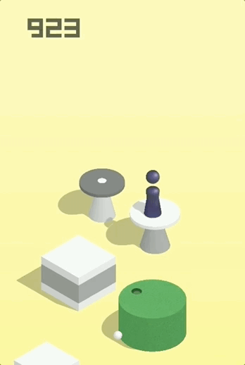

# 游戏模式

> 2017 年 12 月 28 日下午，微信发布了 6.6.1 版本，加入了「小游戏」功能，并提供了官方 DEMO「跳一跳」。这是一个 2.5D 插画风格的益智游戏，玩家可以通过按压屏幕时间的长短来控制这个「小人」跳跃的距离。分数越高，那么在好友排行榜更加靠前。通过 **NodeJS** 脚本自动运行，让你轻松霸榜。



可能刚开始上手的时候，因为时间距离之间的关系把握不恰当，只能跳出几个就掉到了台子下面。**如果能利用图像识别精确测量出起始和目标点之间测距离，就可以估计按压的时间来精确跳跃。**

# 原理说明

1. 将手机点击到《跳一跳》小程序界面
2. 用 ADB 工具获取当前手机截图，并用 ADB 将截图 pull 上来
```shell
adb shell mkdir -p /sdcard/wscats
adb shell screencap -p /sdcard/wscats/screen.png
adb pull /sdcard/wscats/screen.png .
adb shell rm -r /sdcard/wscats/
```

3. 计算按压时间

因为写的这个是手动版本，在浏览器端显示游戏页面，用鼠标先点击起始点位置，然后点击目标位置，用勾股定理计算像素距离，再根据距离计算触按屏幕时间

4. 用 ADB 工具点击屏幕蓄力一跳
```shell
adb shell input swipe x y x y time(ms)
```
# 使用教程

1. 用GIT或者[DownloadZIP](https://github.com/Wscats/wechat-jump-game/archive/master.zip)下载项目，并在终端中执行以下命令
```shell
git clone https://github.com/Wscats/wechat-jump-game
cd wechat-jump-game
node index
```

2. 打开浏览器，输入以下[地址](http://localhost:1314/index.html)，然后打开微信跳一跳游戏界面，并在浏览器页面中进行点击操作
```shell
http://localhost:1314/index.html
```

相关软件工具安装和使用步骤请参考[Node环境下使用adb驱动安卓手机](https://github.com/Wscats/node-tutorial/issues/24)或者[Android 和 iOS 操作步骤](https://github.com/wangshub/wechat_jump_game/wiki/Android-%E5%92%8C-iOS-%E6%93%8D%E4%BD%9C%E6%AD%A5%E9%AA%A4)

# 参考项目

这里的思路参考了[python 微信《跳一跳》辅助](https://github.com/wangshub/wechat_jump_game)，用Nodejs重写了逻辑